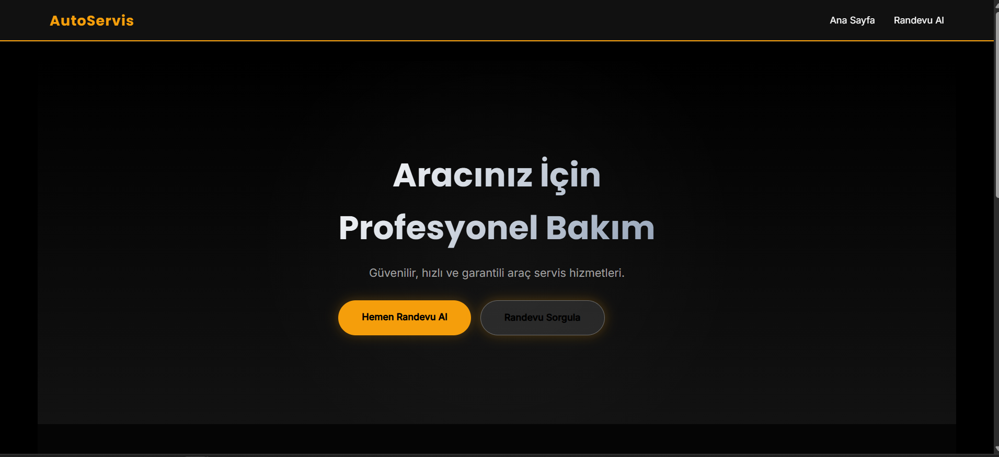
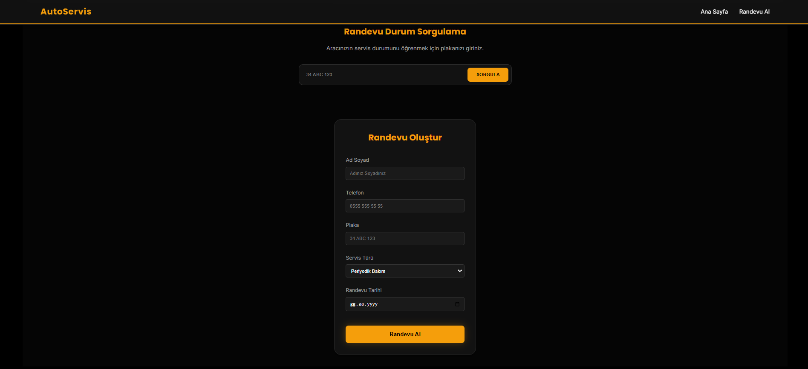
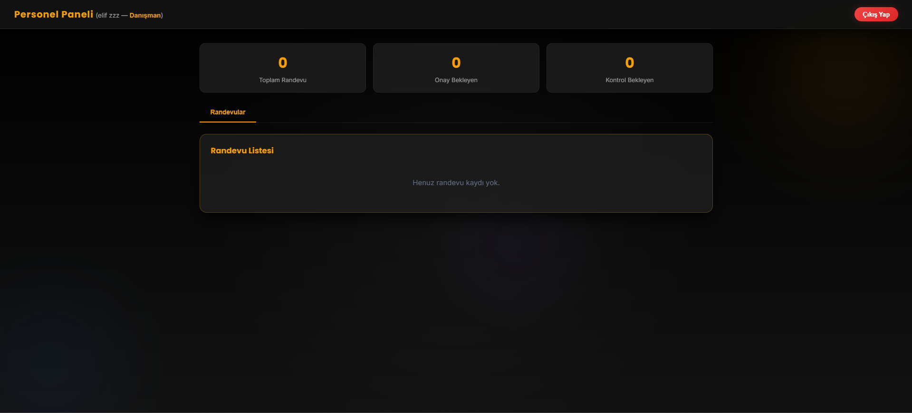
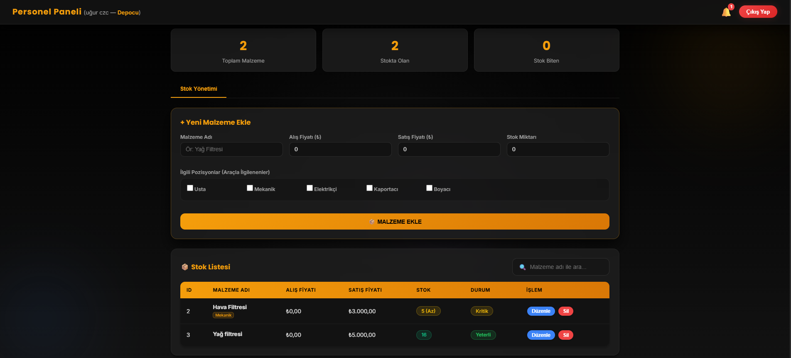
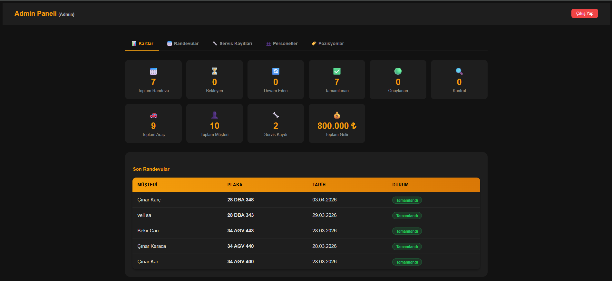
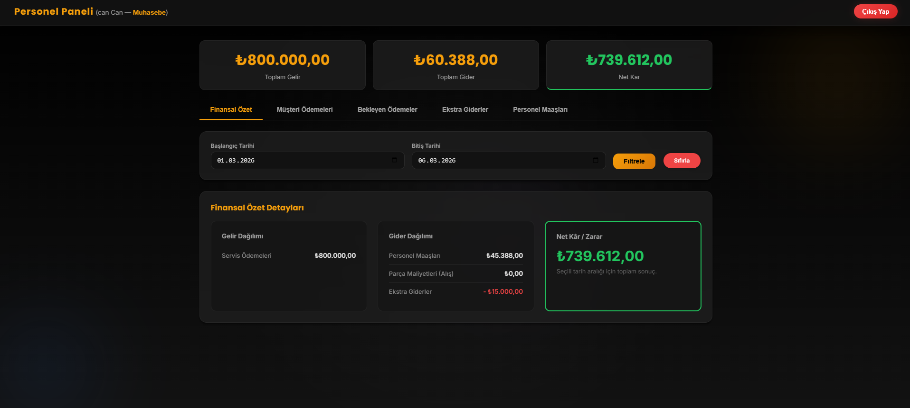
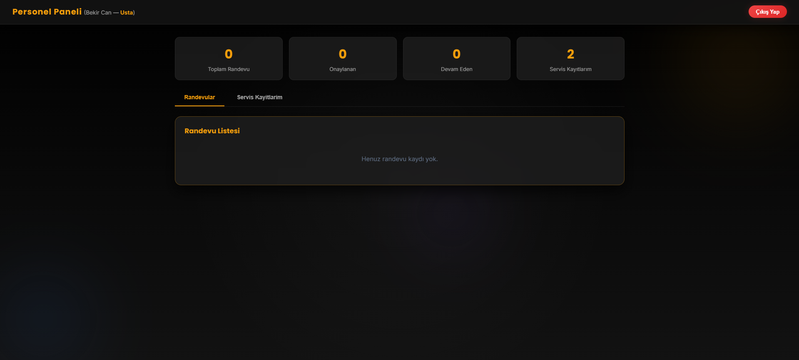

<p align="center">
  
  
  
  
</p>

# 🔧 Araç Servis Yönetim Sistemi

**Araç Servis Yönetim Sistemi**, oto servis işletmeleri için geliştirilmiş kapsamlı bir web tabanlı yönetim uygulamasıdır. Müşteri takibi, araç kayıtları, randevu planlaması, servis süreçleri, parça/stok yönetimi, ödeme takibi ve personel yönetimi gibi tüm operasyonel süreçleri tek bir platform üzerinden yönetmenizi sağlar.

---

## 📸 Ekran Görüntüleri

### 🏠 Ana Sayfa


### 📅 Randevu Oluşturma


### 👷 Personel Paneli — Danışman Görünümü


### 📦 Stok Yönetimi — Depocu Görünümü


### 🛡️ Admin Paneli — Dashboard


### 💰 Personel Paneli — Muhasebe Görünümü


### 🔧 Personel Paneli — Usta Görünümü


### ⚙️ Personel Paneli — Mekanik Görünümü


---

## ✨ Özellikler

### 🛡️ Admin Paneli
- 👥 **Müşteri Yönetimi** — Müşteri ekleme, düzenleme ve silme
- 🚗 **Araç Yönetimi** — Plaka, marka, model, yıl ve şasi numarası ile araç kayıtları
- 📅 **Randevu Yönetimi** — Araç giriş/çıkış tarihi, km bilgisi ve durum takibi
- 👷 **Personel Yönetimi** — Personel bilgileri, pozisyonlar, maaş ve durum takibi
- 💰 **Ödeme Takibi** — Nakit/kredi kartı ödeme kayıtları
- 📊 **Ekstra Gider Takibi** — Kira, fatura ve diğer işletme giderleri

### 🔨 Personel Paneli
- 🔐 **Rol Tabanlı Erişim** — Her personel pozisyonuna özel görünüm (Mekanik, Boyacı, Depocu vb.)
- 🔍 **Araç Kontrol & İnceleme** — Mekanikler için araç ihtiyaç analizi ve servis kaydı oluşturma
- 📦 **Stok Yönetimi** — Depocu rolü için parça stok takibi, ekleme, düzenleme ve silme
- 🔔 **Bildirim Sistemi** — Stok azaldığında veya tükendiğinde depoculara otomatik bildirim
- 🧩 **Servis Parça Ataması** — Servise kullanılan parçaların kaydı ve stoktan düşürülmesi

### 🌐 Genel
- 📱 **Responsive Tasarım** — Mobil ve masaüstü uyumlu arayüz
- 🎨 **Modern UI** — SweetAlert2 ile şık bildirimler ve onay diyalogları
- 🔒 **Oturum Yönetimi** — Session tabanlı giriş/çıkış sistemi
- ⚡ **Gerçek Zamanlı İşlemler** — AJAX tabanlı CRUD operasyonları

---

## 🏗️ Teknoloji Yığını

| Katman | Teknoloji |
|---|---|
| **Framework** | ASP.NET Core 8.0 (Razor Pages) |
| **ORM** | Entity Framework Core 9.x |
| **Veritabanı** | Microsoft SQL Server |
| **Ön Yüz** | HTML5, CSS3, JavaScript, Bootstrap |
| **UI Bileşenleri** | SweetAlert2 |
| **Mimari** | MVC / Razor Pages (MVVM) |

---

## 📁 Proje Yapısı

```
AracServis/
├── AracServis.sln                 # Solution dosyası
├── ServisDB.bak                   # Veritabanı yedeği
│
├── AracServis/                    # Ana proje klasörü
│   ├── Program.cs                 # Uygulama başlangıç noktası
│   ├── appsettings.json           # Yapılandırma dosyası
│   │
│   ├── Models/                    # Veri modelleri
│   │   ├── Arac.cs                # Araç modeli (Plaka, Marka, Model, Yıl)
│   │   ├── Musteri.cs             # Müşteri modeli (Ad, Telefon, E-posta)
│   │   ├── Personel.cs            # Personel modeli (Ad, Pozisyon, Maaş)
│   │   ├── Randevu.cs             # Randevu modeli (Tarih, Km, Durum)
│   │   ├── ServisKaydi.cs         # Servis kaydı (İşçilik, Parça tutarları)
│   │   ├── Parca.cs               # Parça/Stok modeli (Fiyat, Stok adedi)
│   │   ├── Odeme.cs               # Ödeme modeli (Tutar, Tip, Tarih)
│   │   ├── Bildirim.cs            # Bildirim modeli (Stok uyarıları)
│   │   ├── EkstraGider.cs         # Ekstra gider modeli (Kira, Fatura)
│   │   ├── Kullanici.cs           # Kullanıcı modeli (Admin/Personel rolleri)
│   │   ├── Pozisyon.cs            # Pozisyon tanımları
│   │   └── ServisParca.cs         # Serviste kullanılan parçalar (ara tablo)
│   │
│   ├── Data/
│   │   └── ServisDbContext.cs     # EF Core veritabanı bağlam sınıfı
│   │
│   ├── Pages/                     # Razor Pages sayfaları
│   │   ├── Index.cshtml           # Ana sayfa
│   │   ├── PersonelLogin.cshtml   # Personel giriş sayfası
│   │   ├── PersonelPanel.cshtml   # Personel yönetim paneli
│   │   ├── Admin/
│   │   │   ├── AdminLogin.cshtml  # Admin giriş sayfası
│   │   │   └── AdminPanel.cshtml  # Admin yönetim paneli
│   │   └── Shared/                # Paylaşılan layout ve bileşenler
│   │
│   ├── Migrations/                # EF Core veritabanı migration dosyaları
│   └── wwwroot/                   # Statik dosyalar (CSS, JS, favicon)
```

---

## 🚀 Kurulum

### Gereksinimler

- [.NET 8.0 SDK](https://dotnet.microsoft.com/download/dotnet/8.0)
- [SQL Server](https://www.microsoft.com/en-us/sql-server/sql-server-downloads) (Express veya üzeri)
- [Visual Studio 2022](https://visualstudio.microsoft.com/) (önerilen) veya VS Code

### Adımlar

**1. Projeyi klonlayın:**

```bash
git clone https://github.com/KULLANICI_ADINIZ/AracServis.git
cd AracServis
```

**2. Veritabanını yapılandırın:**

`appsettings.json` dosyasındaki bağlantı dizesini kendi SQL Server bilgilerinize göre güncelleyin:

```json
{
  "ConnectionStrings": {
    "DefaultConnection": "Server=SUNUCU_ADINIZ;Database=ServisDB;Trusted_Connection=True;TrustServerCertificate=True;"
  }  
}
```

**3. Veritabanını oluşturun:**

**Seçenek A** — Migration kullanarak:
```bash
cd AracServis
dotnet ef database update
```

**Seçenek B** — Yedek dosyadan geri yükleme:
SQL Server Management Studio (SSMS) üzerinden `ServisDB.bak` dosyasını restore edin.

**4. Uygulamayı çalıştırın:**

```bash
dotnet run
```

Uygulama varsayılan olarak `https://localhost:5001` adresinde çalışacaktır.

---

## 👤 Kullanıcı Rolleri

| Rol | Açıklama | Erişim |
|---|---|---|
| **Admin** | Tam yetki — tüm sistem yönetimi | Admin Panel |
| **Mekanik** | Araç kontrol, servis kaydı oluşturma | Personel Panel |
| **Boyacı** | Boya işleri ile ilgili görevler | Personel Panel |
| **Depocu** | Stok yönetimi, parça takibi | Personel Panel |
| **Diğer Pozisyonlar** | Pozisyona özel görünümler | Personel Panel |

---

## 🤝 Katkıda Bulunma

Katkıda bulunmak isterseniz:

1. Bu depoyu **fork** edin
2. Yeni bir **branch** oluşturun (`git checkout -b feature/yeni-ozellik`)
3. Değişikliklerinizi **commit** edin (`git commit -m 'Yeni özellik eklendi'`)
4. Branch'inizi **push** edin (`git push origin feature/yeni-ozellik`)
5. Bir **Pull Request** açın

---

## 📄 Lisans

Bu proje [MIT Lisansı](LICENSE) ile lisanslanmıştır.

---

<p align="center">
  <b>⭐ Bu projeyi beğendiyseniz yıldız vermeyi unutmayın!</b>
</p>
